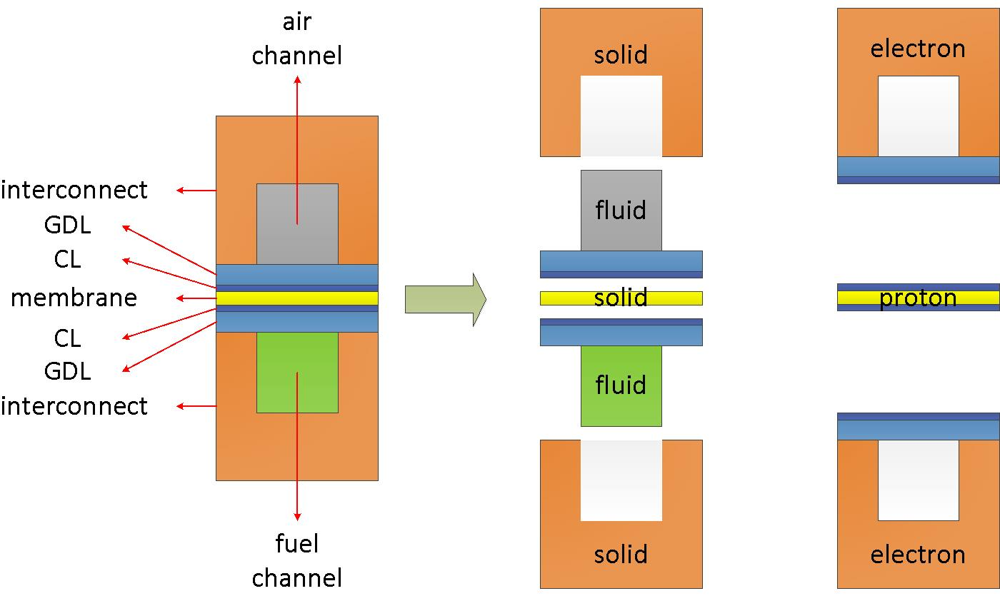

# fuelCell0Foam

A CFD solver for fuel cells and electrolyzers.

---

The source code was developed from an open-source repository [openFuelCell](http://openfuelcell.sourceforge.net/) and the standard solver "reactingTwoPhaseEulerFoam" in OpenFOAM. It can be used to consider coupling transport phenomena in electrochemical devices, e.g. fuel cells, electrolyzers, etc. More applications will be available in the future.

The source code is being cleaned up and necessary comments will be added. This code will hopefully be made open-source for fuel cell/electrolyzer communities.

## How to use

---

The code is compiled based on the OpenFOAM libraries, either [Foundation version](https://openfoam.org/) or [ESI version](https://www.openfoam.com/). The default branch is compatable with the foundation version, while the branch 'ofESI' works with the OpenFOAM-ESI environment.

- [Foundation version](https://openfoam.org/)

```bash
# Download the source code
git clone XXX fuelCell0Foam

cd fuelCell0Foam

./Allwmake
```

- [ESI version](https://www.openfoam.com/)

```bash
# Download the source code
git clone XXX fuelCell0Foam

cd fuelCell0Foam

# Switch to the 'ofESI' branch
git switch ofESI

./Allwmake
```

You can also clear the libraries and executable files with

```bash
./Allwclean
```

## Related publications

- *Journal*

  - **Zhang, Shidong, Steven B. Beale, Uwe Reimer, Martine Andersson, and Werner Lehnert. "Polymer electrolyte fuel cell modeling-A comparison of two models with different levels of complexity." International Journal of Hydrogen Energy 45, no. 38 (2020): 19761-19777.**

  - **Zhang, Shidong, Steven B. Beale, Yan Shi, Holger Janßen, Uwe Reimer, and Werner Lehnert. "Development of an Open-Source Solver for Polymer Electrolyte Fuel Cells." ECS Transactions 98, no. 9 (2020): 317.**

- *Thesis*

  - **Zhang, Shidong. Modeling and Simulation of Polymer Electrolyte Fuel Cells. No. FZJ-2020-02318. Elektrochemische Verfahrenstechnik, 2020.**

## Developers

---

The code is firstly developed by [Shidong Zhang](s.zhang@fz-juelich.de) for the PhD thesis, supervised by Prof. [Werner Lehnert](w.lehnert@fz-juelich.de) and Prof. [Steven Beale](s.beale@fz-juelich.de). The detailed model description and simulation results can be found in the thesis, *Modeling and Simulation of Polymer Electrolyte Fuel Cells*. However, the code is not ready for the public yet. The following persons contribute to the optimization of the code,

- Mr. Tianliang Cheng (t.cheng@fz-juelich.de), Forschungszentrum Juelich, IEK-14
  - Tianliang Cheng is a PhD candidate.

- Mr. Steffen Hess (s.hess@fz-juelich.de), Forschungszentrum Juelich, IEK-14
  - Steffen Hess is a PhD candidate.

- Prof. Steven Beale (s.beale@fz-juelich.de), Forschungszentrum Juelich, IEK-14

## Recent updates

---

- [Oct. 2020] A new branch for openFOAM-ESI
  > The majority part of this update was conducted by Mr. Steffen Hess. The code is able to compile in the OpenFOAM-ESI environment.
- [Nov. 2020] The new branch for openFOAM-ESI
  > Some bugs were found and fixed:
    1. The compiling sequence.
    2. The locations of gravity fields, g. The files "g" move to constant/.
    3. The functionObjects library is missing.
    4. Remove some warnings: apply new functions in OpenFOAM-ESI.

## Computational domains

---

Take the cross-section of a fuel cell as an example. The computational domain gives,

<div align="center">
  
</div>

In a PEM fuel cell, there are several domains/regions: air, fuel, electrolyte, and interconnect. This can be found from the repository [openFuelCell](http://openfuelcell.sourceforge.net/). However, additional domains/regions, e.g. phiEA, phiEC, and phiI are also necessary to account for electron/proton and dissolved water transfer.

To consider the coupling transfer problems in a PEM fuel cell, a master region, also called as parent mesh, and several sub-regions, also called as child meshes, are used. In the master region, only energy equation is solved. In the sub-regions, corresponding partial differential equations will be solved. During the simulation, material properties, e.g. density, thermal conductivity, etc., are mapped from sub-regions to the master region, while the temperature field is mapped from the master region to the sub-regions.

The sub-regions can be classified as three different types, namely fluid, solid, and electron/proton regions. See the [code](fuelCellSystems/fuelCellSystem/regions).

- Fluid region:

  This region represents the space where fluid flows by. In a fuel cell or electrolyzer, it consists with gas channels and/or porous regions. In this region, the following processes are addressed:

  - Fluid flow (single/two phase)
  - Species transfer
  - Electrochemical reaction
  - Heat and mass transfer

  For example, in a fuel cell, the following parts apply to this type,

  - Air flow paths + porous electrodes
  - Fuel flow paths + porous electrodes
  - Cooling channels

- Solid region:

  This represents the solid components. In this solver, no eqautions will be solved here. However, in future applications, stress analysis during assembly and thermal effects may be implemented.

  In a fuel cell, the following components apply to this type,

  - Electrolyte/membrane
  - Interconnect/Bipolar-plate
  - Endplate

- Electron/proton region:

  This region accounts for the electric-conductive components. This region is designed to consider electron/proton transfer specifically. However, it is found that the proton transfer region is the same as the region where dissolved water transfer takes place. Therefore, a switcher is set in the code to turn on/off the dissolved water transfer model. The following eqautions will be solved,

  - Potential equations (Possion equations)
  - Dissolved water transfer equations (diffusion and electro-osmotic-drag)

  In a fuel cell, the following regions belong to this type:

  - Bipolar-plate, GDL, MPL, CL -> electron transfer regions
  - Catalyst coated membrane, CCM, -> proton transfer and dissolved water transfer region

- Master region:

  The heat source/sinks in sub-regions will be mapped to this region. And the obtained temperature is mapped back to sub-regions. The heat source/sink include:

  - Joule heat from the electron/proton regions.
  - Phase change in the fluid regions.
  - Electrochemical reactions in the fluid regions.

## Code structures

- 1st level:

```none
  fuelCellFoam.C  [Main code]
  EEqns.H         [Enthalpy equation]
  createFields.H  [Create necessary fields]
  fuelCellSystems [All of the necessary models]
  include         [Courant, delta time, etc.]
  tools           [Tools for topoSet and mesh decomposition]
  tutorial        [Test cases]
```

- 2nd level:

  - fuelCellSystems

   ```none
    derivedFvPatchFields          [Two phase models boundary conditions]
    functionObjects               [Two phase models functions]
    interfacialCompositionModels  [Two phase models, interfacial composition, mass transfer, saturation, and surface tension]
    interfacialModels             [Two phase models, interfacial momentum transfer terms]
    multiPhaseCompressibleTurbulenceModels  [Turbulent model for two phase flow, not necessary at this point.]
    regionCourantNo               [Courant number]
    fuelCellSystem                [Models for fuel cells or other applications]
   ```

  - tools

   ```none
    decomposeParID              [Generate cell IDs for manual decomposition]
    masterRegionToCell          [Create cell sets from the regions in master region]
    topoSet                     [Recompile topoSet to include masterRegionToCell]
   ```

- 3rd level (fuelCellSystem):

```none
      activationOverpotentialModels     [Activational overpotential models, e.g. Butler-Volmer, Tafel]
      diameterModels                    [Droplets/Bubbles diamter]
      dissolvedModel                    [Dissolved water transfer in membrane]
      nernstModel                       [Nernst potential]
      phasePair                         [Types of paired objects]
      PhaseSystems                      [Templates for different problems in multi-phase flows]
      porosityModel                     [Porosity models in porous regions]
      regions                           [Different types of regions]
      solvers                           [Selectable solvers, e.g. single phase, two phase, or drift-flux]
      BlenderInterfacialModels          [Blender functions for interfacial momentum transfer terms]
      diffusivityModels                 [Species diffusion models, Fick's law]
      phaseModel                        [Multi-models for each phase]
      phaseSystem                       [Phase systems for fluid flow]
      sigmaModels                       [Electric conductivity]
      populationBalanceModel            [Model for bubble columns]
      reactionThermo                    [Thermo models for reactions]
```

To be continued...

## Case structure

```none
  0/                                    [Initial and boundary conditions]
    air/                                  [Air region]
      alpha.air                             [Fields of gas phase saturation]
      alpha.water                           [Fields of liquid phase saturation]
      T.air                                 [Fields of gas phase temperature]
      T.water                               [Fields of liquid phase temperature]
      H2O.air                               [Fields of water vapor mass fraction]
      N2.air                                [Fields of nitrogen mass fraction]
      O2.air                                [Fields of oxygen mass fraction]
      p                                     [Fields of pressure]
      p_rgh                                 [Fields of pressure - rho*g*h]
      U.air                                 [Fields of gas phase velocity]
      U.water                               [Fields of liquid phase velocity]
    fuel/                                 [Fuel region]
      alpha.fuel                            [Fields of gas phase saturation, always 1 in single phase flow]
      T.fuel                                [Fields of temperature]
      H2.fuel                               [Fields of hydrogen mass fraction]
      H2O.fuel                              [Fields of water vapor mass fraction]
      p                                     [Fields of pressure
      p_rgh                                 [Fields of pressure - rho*g*h]
      U.fuel                                [Fields of velocity]
    electrolyte/                          [Electrolyte region]
      p                                     [Fields of pressure, constant in solid region]
      T                                     [Fields of temperature]
    interconnect/                         [Interconnect region]
      p                                     [Fields of pressure, constant in solid region]
      T                                     [Fields of temperature]
    phiEA/                                [PhiEA region, potential field at anode side]
      phi                                   [Fields of potential]
    phiEC/                                [phiEC region, potential field at cathode side]
      phi                                   [Fields of potential]
    phiI/                                 [phiI region, potential field at CCM]
      lambda                                [Fields of water content]
      phi                                   [Fields of potential]
  config/                               [Information for cell sets]
  Makefile                              [Make file]
  parallel.csh                          [Script for parallel pre-processing]
  pre                                   [Script for pre-processing]
  pResidualPlot                         [Residual plot for parallel runs]
  sResidualPlot                         [Residual plot for serial runs]
  constant                              [Model and parameter selections, polyMesh]
    cellProperties                        [General settings of the application]
    regionProperties                      [Types of regions]
    polyMesh/                             [Finite volume mesh information]
    air/                                  [Air region]
      g                                     [Gravity]
      phaseProperties                       [Properties of each phase]
      regionProperties                      [Properties of air region]
      thermophysicalProperties.air          [Thermo information of the gas phase]
      thermophysicalProperties.water        [Thermo information of the liquid phase]
      combustionProperties.air              [Electrochemical reaction settings]
      porousZones                           [Porosity regions]
      turbulenceProperties.air              [Turbulent models for the gas phase. Laminar in use]
      turbulenceProperties.water            [Turbulent models for the liquid phase. Laminar in use]
      polyMesh/                             [Finite volume mesh information]
    fuel/                                 [Fuel region]
      g                                     [Gravity]
      phaseProperties                       [Properties of each phase]
      regionProperties                      [Properties of fuel region]
      thermophysicalProperties.fuel         [Thermo information of the gas phase]
      combustionProperties.fuel             [Electrochemical reaction settings]
      porousZones                           [Porosity regions]
      turbulenceProperties.fuel             [Turbulent models for the gas phase. Laminar in use]
      polyMesh/                             [Finite volume mesh information]
    electrolyte/                          [Electrolyte region]
      regionProperties                      [Properties of electrolyte region]
      thermophysicalProperties              [Thermo information]
      polyMesh/                             [Finite volume mesh information]
    interconnect/                         [Electrolyte region]
      regionProperties                      [Properties of interconnect region]
      thermophysicalProperties              [Thermo information]
      polyMesh/                             [Finite volume mesh information]
    phiEA/                                [PhiEA region]
      regionProperties                      [Properties of phiEA region]
      polyMesh/                             [Finite volume mesh information]
    phiEC/                                [PhiEC region]
      regionProperties                      [Properties of phiEC region]
      polyMesh/                             [Finite volume mesh information]
    phiI/                                 [PhiI region]
      regionProperties                      [Properties of phiI region]
      polyMesh/                             [Finite volume mesh information]
  system/                               [Finite volume method simulation settings]
    controlDict                           [Simulation control]
    blockMeshDict                         [Mesh generation]
    decomposeParDict                      [Mesh decomposition]
    fvSchemes                             [Schemes in temporal and spatial discretization]
    fvSolution                            [Matrix solution and solution control]
    air/                                  [Finite volume method settings to air region]
      decomposeParDict                      [Mesh decomposition]
      fvSchemes                             [Schemes in temporal and spatial discretization]
      fvSolution                            [Matrix solution and solution control]
    fuel/                                 [Finite volume method settings to fuel region]
      decomposeParDict                      [Mesh decomposition]
      fvSchemes                             [Schemes in temporal and spatial discretization]
      fvSolution                            [Matrix solution and solution control]
    electrolyte/                          Finite volume method settings to electrolyte region]
      decomposeParDict                      [Mesh decomposition]
    interconnect/                         Finite volume method settings to interconnect region]
      decomposeParDict                      [Mesh decomposition]
    phiEA/                                [Finite volume method settings to phiEA region]
      decomposeParDict                      [Mesh decomposition]
      fvSchemes                             [Schemes in temporal and spatial discretization]
      fvSolution                            [Matrix solution and solution control]
    phiEC/                                [Finite volume method settings to phiEC region]
      decomposeParDict                      [Mesh decomposition]
      fvSchemes                             [Schemes in temporal and spatial discretization]
      fvSolution                            [Matrix solution and solution control]
    phiI/                                 [Finite volume method settings to phiI region]
      decomposeParDict                      [Mesh decomposition]
      fvSchemes                             [Schemes in temporal and spatial discretization]
      fvSolution                            [Matrix solution and solution control]
```

To be continued...
